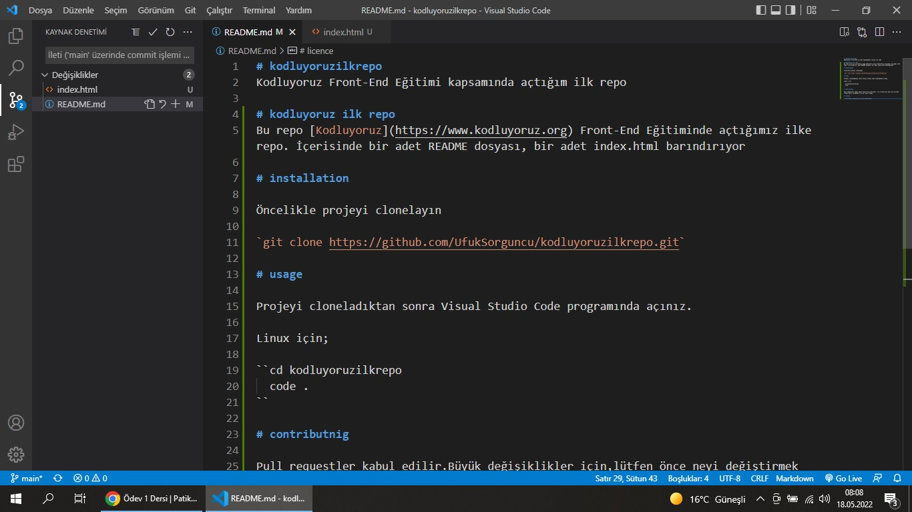

# kodluyoruzilkrepo
Kodluyoruz Front-End Eğitimi kapsamında açtığım ilk repo

# kodluyoruz ilk repo
Bu repo [Kodluyoruz](https://www.kodluyoruz.org) Front-End Eğitiminde açtığımız ilke repo. İçerisinde bir adet README dosyası, bir adet index.html barındırıyor

# installation

Öncelikle projeyi clonelayın

`git clone https://github.com/UfukSorguncu/kodluyoruzilkrepo.git`

# usage

Projeyi cloneladıktan sonra Visual Studio Code programında açınız.

Linux için;

``cd kodluyoruzilkrepo
  code .
``

# contributnig

Pull requestler kabul edilir.Büyük değişiklikler için,lütfen önce neyi değiştirmek istediğinizi tartışmak için bir konu açınız.

# licence

[MIT](https://opensource.org/licenses/MIT)

